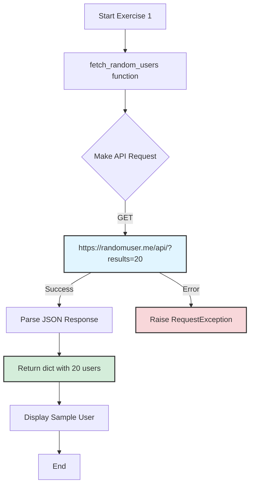
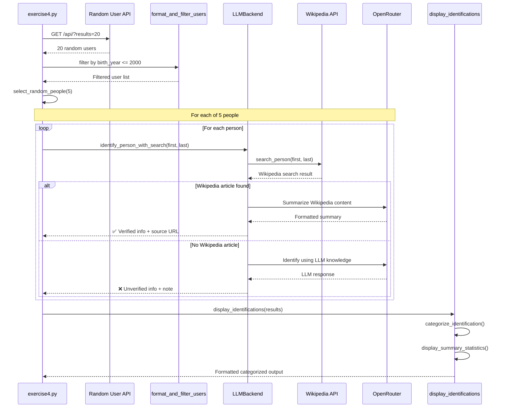
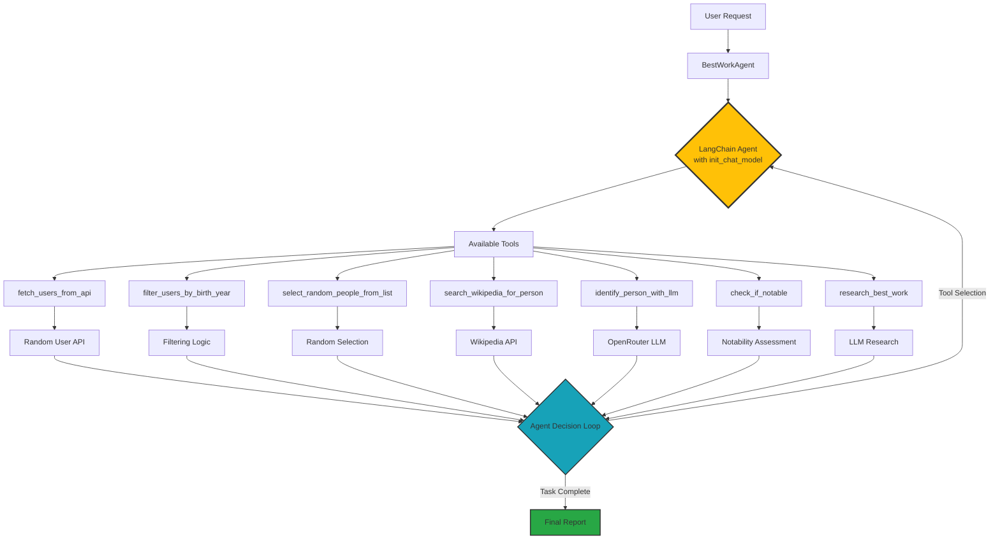
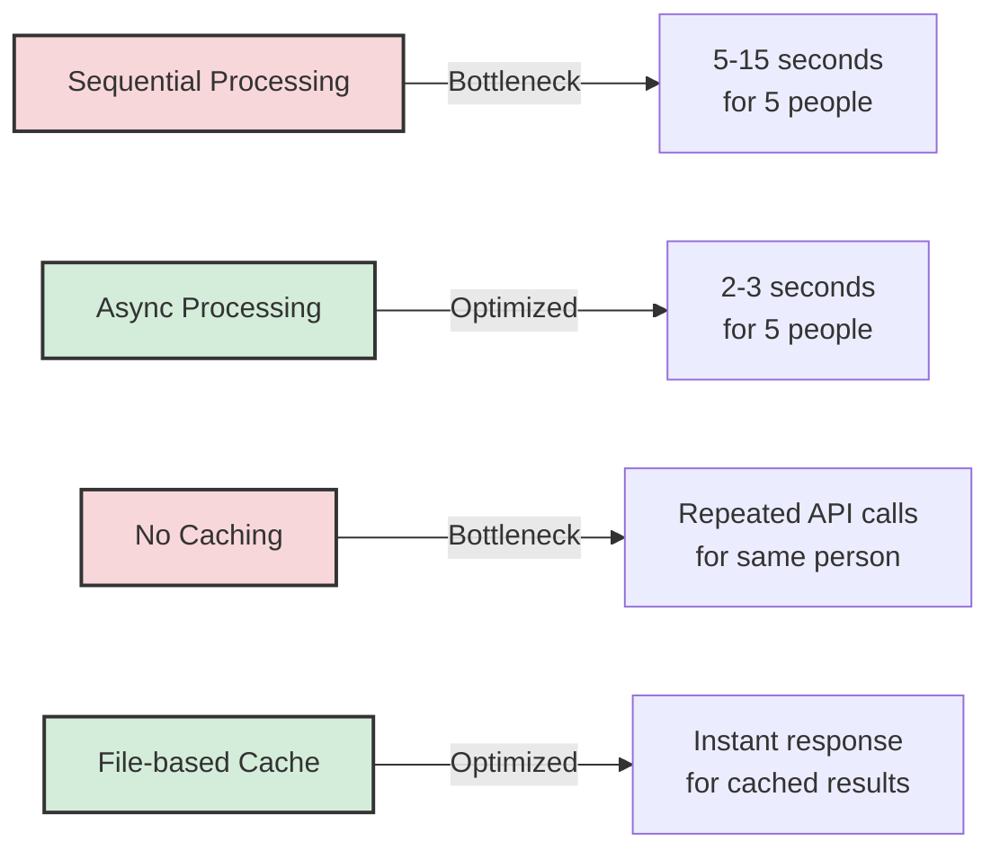
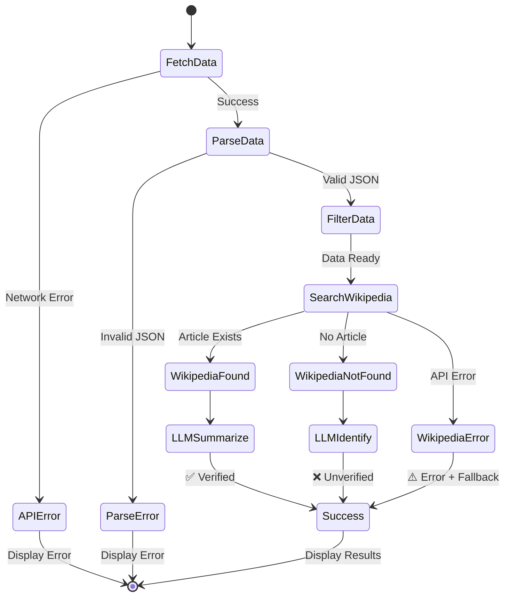
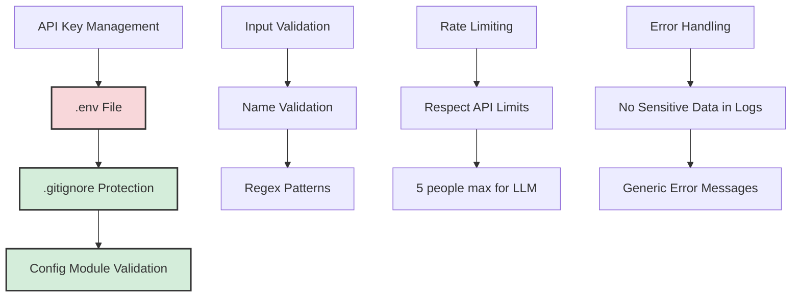

# Architecture Flow Documentation

This document provides comprehensive architecture diagrams for the NN Exercise project, showing the flow of data and interactions between components across all exercises.

## Table of Contents

1. [Exercise 1: Data Fetching](#exercise-1-data-fetching)
2. [Exercise 4: LLM Person Identification](#exercise-4-llm-person-identification)
3. [Exercise 5: LangChain Agentic Workflow](#exercise-5-langchain-agentic-workflow)

## Exercise 1: Data Fetching

Simple API integration to fetch random user data.

**Key Components:**

- `fetch_random_users()`: Makes HTTP GET request
- Error handling for network issues
- Returns raw JSON response

---

## Exercise 4: LLM Person Identification

Multi-step identification using Wikipedia + LLM.

**Key Features:**

- **Wikipedia-first approach**: Searches Wikipedia before using LLM
- **Categorization**: Verified, Unknown, Fictional, Error
- **Source attribution**: Shows Wikipedia URLs when available
- **Fallback mechanism**: Uses LLM knowledge if Wikipedia fails

---

## Exercise 5: LangChain Agentic Workflow

Autonomous agent with tool-calling capabilities.

**Agentic Capabilities:**

1. **Autonomous tool selection**: Agent decides which tools to use
2. **Multi-step reasoning**: Chains multiple tool calls together
3. **Iterative refinement**: Can retry with different approaches
4. **Context awareness**: Maintains conversation state

---

## Performance Considerations

Current bottlenecks and optimization opportunities:

**Optimization Strategies:**

1. **Async/Concurrent Processing**: Use `asyncio` for parallel API calls (5-10x speedup)
2. **Caching**: Cache Wikipedia + LLM results (instant for repeated queries)
3. **Connection Pooling**: Reuse HTTP connections (small latency reduction)
4. **Batch Optimization**: Process multiple people in single LLM call (token efficiency)

---

## Error Handling Flow

---

## Security Considerations

